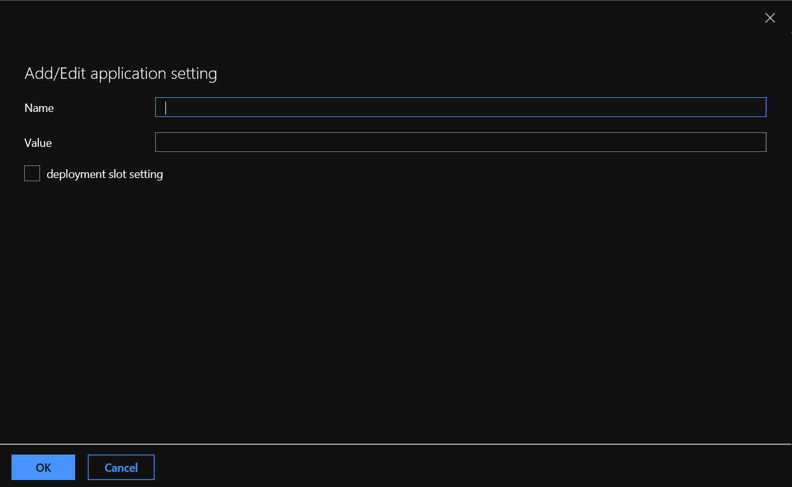

# API Application Instructions
This API servers as the primary backend for the PowerApps Application and uses the AAD authentication for checking valid requests. 

The application fetches the API KEY for the Enterprise API which is stored in an Azure Key Vault and a call is then made to the Enterprise API. The response payload from the Enterprise API is then sent back to the powerApps for consumption

As part of this exercise, we expect the users would publish this application to an Azure API App.

Below application settings will be needed for setting up the key.

a) Goto the Azure API App on the portal
b) API App --> Settings --> Configuration --> Application Settings
c) Click on '+ New Application Setting'

d) In the New Application Setting Balde, enter the values for configuring the API Match Key with below values

Name :  keyVault

Value : << Name of the Azure KeyVault>>

