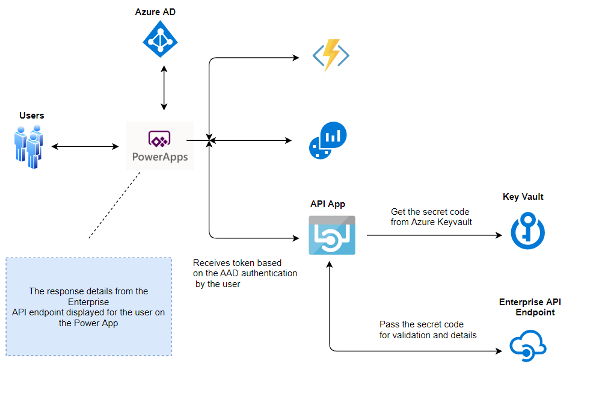

# Azure Set-up Instructions for HOL Demo

Follow the below instructions to set-up the target architecture

a) Deploy Azure Components (API App, Mock API App, Key Vault and Key Vault Secret)
 

 

b) Verify the Azure Template Deployment is complete successfully

c) Verify the Azure Key vault set-up

     i) Goto Azure Resource Group --> KeyVault --> Settings --> Secrets (Verify the secret is created)
     
    ii) KeyVault --> Settings --> Access Policies (Verify the API Application is granted access)

