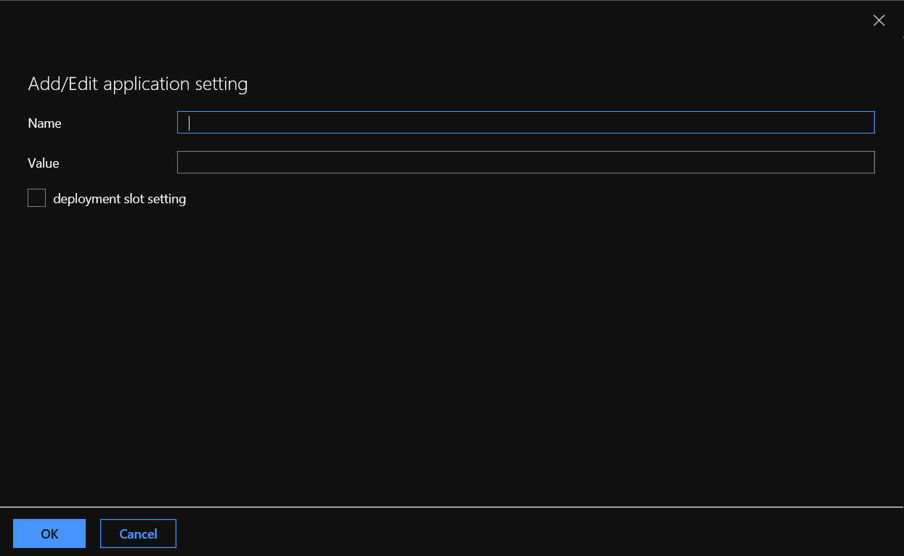

# Mock Enterprise API Instructions
The Mock Enterprise API has a configurable Key which will be validated by the API to authenticate legitimate requests and send a response.

As part of this exercise, we expect the users would publish this application to an Azure API App.

Below application settings will be needed for setting up the key.

a) Goto the Azure API App on the portal
b) API App --> Settings --> Configuration --> Application Settings
c) Click on '+ New Application Setting'

d) In the New Application Setting Balde, enter the values for configuring the API Match Key with below values

